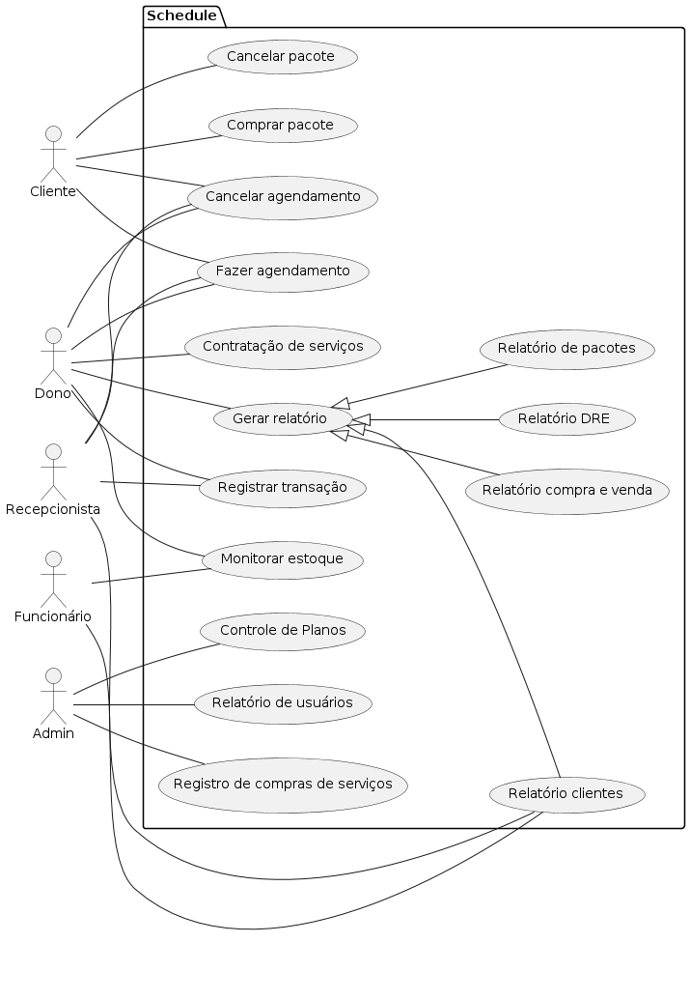

# Engenharia de Software II
## Integrantes
 
 André Richard Michael Cardoso (ARMCardoso) 
 Gabriel Alves Rodrigues (GabrielAlves027) 
 Ítalo Béllo Silva (Lflickr) 
 Kaike Freitas de França (KaikeFF) 
 
## Sistema de Gestão para Salão Masculino/Feminino

Um sistema de gestão para salão de beleza/barbeiro deve ser acessível, intuitivo e abrangente, deste modo, deverá integrar as funcionalidades essenciais para a eficiência operacional: gestão de clientes, controle de clientes, controle financeiro, automação de tarefas administrativas, controle de caixa, geração de relatórios para ajudar na tomada de decisão, integração com meios de pagamento, agendamento, oferecimento de pacotes e assinaturas para ajudar na fidelização de clientes. Este sistema deve ser projetado para atender às necessidades específicas desse grupo de empreendedores, com a finalidade de facilitar a administração e controle. Além disso, o sistema deve conter suporte técnico (para duvidas e problemas frequentes), ter uma boa segurança dos dados (garantir a privacidade dos dados importantes, ter um sistema de backup automático) e garantir o acesso remoto via dispositivos moveis (celulares e tablets), além de fornecer um aplicativo e um site para possíveis clientes do salão, onde o cliente poderá agendar horários e assinar planos, além de também consultar disponibilidade e efetuar pagamentos prévios do atendimento.
 
## Modelo de Negocio
 
 https://github.com/ARMCardoso/ES2/blob/main/Doc/Modelo_de_Negocio.md 
 
## Tecnologias Utilizadas
### Back-end:
- Java-Spring
 
 
### Mobile:
- React Native
 
 
### Front-end:
- HTML5
- CSS3
- JavaScript
- React.js
 
 
### Banco de Dados:
- SQLDeveloper
- Oracle Database
 
 
### Ferramentas de Desenvolvimento:
- Android Studio
- VS Code
- GitHub
- Git Bash
- BRmodelo
 
 
## Casos de uso
### Controle de Estoque
  - Monitoramento de estoque
### Gestão Financeira
  - Registrar transações
  - Demonstração de Resultado do Exercício
  - Controle de Caixa
  - Relatório de compra e venda
### Gestão de Clientes
  - Monitorar Clientes
  - Realizar Agendamentos
  - Cancelar Agendamentos
  - Criar Pacote
  - Excluir Pacotes
  - Assinar Pacote
  - Cancelar Assinatura
  - Relatório de Clientes
### Controle do Sistema
  - Registro de Compra de Serviços
  - Contratação de Serviços
  - Relatório de Usuários
 
  ## Telas
### Aplicação
  - Tela de Cadastro de Contratante
  - Tela de Login
  - Tela de Pagamento e Contratação de Serviços
  - Tela Principal/Home
  - Tela Inicial da Aplicação WEB
### Estoque
- Tela de Cadastro de Produto para Controle de Estoque
- Tela de Ficha de Estoque
### Financeiro e Tomada de Decisão
- Tela de Demonstração de Resultado do Exercício
- Tela dos Relatórios
   - Relatório de Compra e Venda
   - Relatório de Clientes
- Tela de Registro de Transações
### Prestação de Serviços
- Tela de Cadastro de Clientes
- Tela de Cadastro de Serviços
- Tela de Cadastro de Prestadores de Serviço
- Tela de Agendamentos
- Tela de Consulta de Agendamentos
- Tela de Listagem de Clientes
 
## Tabelas
### Estoque
- Tabela de Produtos
### Prestação de Serviços
- Tabela de Clientes
- Tabela de Serviços
- Tabela de Prestadores de Serviço
### Administrador
- Tabela de Usuários
 
## Relatórios
### Financeiro
- Relatório de demonstração de resultados do exercício
 
### Tomada de decisão
- Relatorio de compra e venda
- Relatório de Clientes
- Relatório de Usuários

## Diagramas:
### Caso de Usos:

