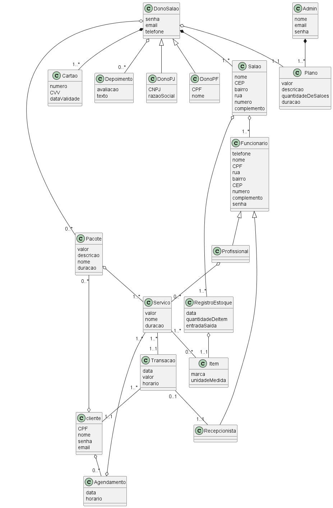
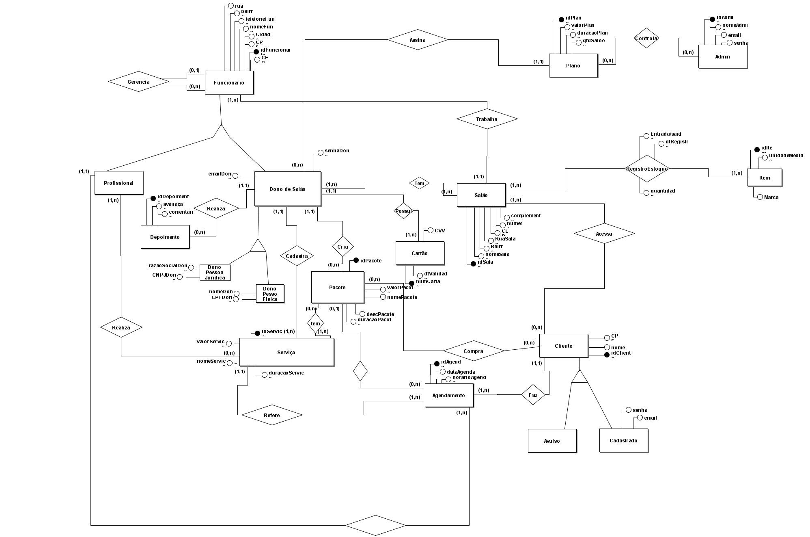
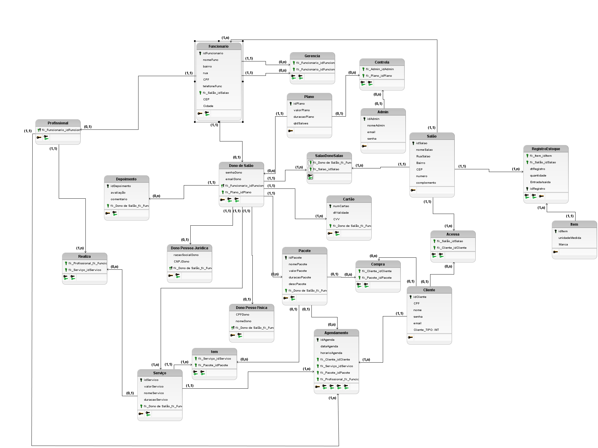

# Engenharia de Software II
## Integrantes
 
 André Richard Michael Cardoso (ARMCardoso) 
 Gabriel Alves Rodrigues (GabrielAlves027) 
 Ítalo Béllo Silva (Lflickr) 
 Kaike Freitas de França (KaikeFF) 
 
## Sistema de Gestão para Salão Masculino/Feminino (SmartBarber)

Um sistema de gestão para salão de beleza/barbeiro deve ser acessível, intuitivo e abrangente, deste modo, deverá integrar as funcionalidades essenciais para a eficiência operacional: gestão de clientes, geração de relatórios para ajudar na tomada de decisão, agendamento, oferecimento de pacotes e assinaturas para ajudar na fidelização de clientes. Este sistema deve ser projetado para atender às necessidades específicas desse grupo de empreendedores, com a finalidade de facilitar a administração e controle. Além disso, o sistema deve ter uma boa segurança dos dados (garantir a privacidade dos dados importantes), além de fornecer um site para possíveis clientes do salão, onde o cliente poderá agendar horários e assinar planos, além de também consultar disponibilidade.
 
## Modelo de Negocio
 
 https://github.com/ARMCardoso/ES2/blob/main/Doc/Modelo_de_Negocio.md 
 
## Tecnologias Utilizadas
### Back-end:
- Java-Spring
 
### Front-end:
- HTML5
- CSS3
- JavaScript
- React.js
 
### Banco de Dados:
- SQLDeveloper
- Oracle Database
 
### Ferramentas de Desenvolvimento:
- VS Code
- GitHub
- Git
- BRmodelo
 
 
## Casos de uso
### Controle de Estoque
  - Monitoramento de estoque
### Gestão Financeira
  - Registrar transações
  - Relatorio de Demonstração de Resultado do Exercício
  - Relatório de compra e venda
### Gestão de Clientes
  - Monitorar Clientes
  - Realizar Agendamentos
  - Cancelar Agendamentos
  - Criar Pacote
  - Excluir Pacotes
  - Assinar Pacote
  - Cancelar Assinatura
  - Relatório de Clientes
### Controle do Sistema
  - Registro de Compra de Serviços
  - Contratação de Serviços
  - Relatório de Usuários
 
  ## Telas
### Cliente
- Tela inicial para o cliente
- Área de agendamentos para o cliente
- Escolha do tipo de agendamento
- Agendamentos para cliente
- Agendar com pacotes
- Tela de verificar/cancelar de agendamentos
- Comprar/cancelar pacotes
- Escolha de pacotes
- Cancelar agendamento

### Recepcionista
- Tela inicial da recepção
- Estoque 
- Registro de transações
- Configurações recepção
- Agendar/Cancelar agendamento
- Gerar Relatório

### Profissional
- Tela inicial do profissional
- Verificar estoque
- Agendamentos do profissional

### Dono
- Visão do dono do salão
- Gerar relatórios
- Estoque
- Registrar/visualizar transações
- Relatório de transações
- Criar agendamento
- Cancelar agendamento

### Administrador
- Tela inicial administrador
- Controle de planos
- Configurar planos
 
## Tabelas
### Estoque
- Tabela de Produtos
### Prestação de Serviços
- Tabela de Clientes
- Tabela de Serviços
- Tabela de Profissionais
- Tablea de Recepcionista
### Administrador
- Tabela de Usuários
 
## Relatórios
### Financeiro
- Relatório de demonstração de resultados do exercício
 
### Tomada de decisão
- Relatorio de compra e venda
- Relatório de Clientes
- Relatório de Usuários

## Diagramas:
### Caso de Usos:

### Diagrama de Classes:

### Modelo Conceitual do Banco de Dados

### Modelo Logico do Banco de Dados
